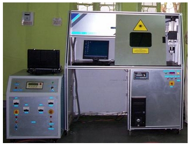

### Experimental setup

1. Sorption of laser beam and conservation of its energy to thermal lattice vibrations;
2. Heating without material damage;
3. Onset of vaporization in the interaction region and scatter of disintegration products
4. Cooling (quenching) after the laser interaction ceases.

The schematic diagram of laser system along with 3-axis gantry used during experimentation is as shown in the Fig 1.2 is the actual photograph of the system.

Fig.1.2 Photograph of Nd: YAG laser system with 3-axis gantry

The specifications of the laser head and 3-axis gantry attached with the system are as below.
* Laser head specifications
* Laser type - Pulsed Nd: YAG
* Wavelength - 1.06&mu;m
* Maximum average output power-200 watts
* Pulse repetition rate - 1&#126;200Hz
* Maximum power per pulse @20msec pulse width - 80Joules
* Pulse width - 100µsec to 20msec
* Beam divergence - 20mrad
* Maximum Beam diameter-8mm
* Beam expander - 2X to 8X with input aperture of maximum 20mm
* Power supply - 3 phase 440 V AC mains input power supply with 32 Amp of current
* Pulse shaping - increasing and decreasing steps for welding
* 3-axis gantry specifications
* Multi - Axis CNC motion systems
* Model: SLP - CNC1824SS
* Table Area: - X = 200, Y = 200, Z = 50 & with &theta; (Rotary axis)
* All axes precision pre loaded ball screws.
* Resolution: - 2 microns
* Motors: Micro stepping motors 2 phase.
* Micro stepping motor with gearbox, on all axes

### Procedure

The experiments are performed for laser hardening of Pearlitic Grey Cast Iron liner material of diesel engine.
**1.0 Material used for experimentation**

Chemical analysis of the material is carried out and its composition is as given in the table 1.1; which reveals it is grey cast iron.

img

**2.0 Preparation of test specimens**

img

The liner supplied has inner bore and outer diameter as 100 and 114 mm respectively. The liner is divided in to 30 parts. Each part is magnitude of 12&deg; perpendicular to the linear axis as shown in fig 1.1. The test specimens prepared are of 30x10 mm size. The preparation of these specimens has been carried out by using Wire EDM (Ecocut).

**3.0 Plan of experiment for Laser Hardening**

Number of spots are considered with different power (interaction time) and spot size to identify the appropriate range. The experiments are divided into two groups.

1. Spots of different beam power at constant beam spot size and
2. Spots of different beam spot size at constant beam power.

**3.1 Spots of different beam power at constant beam spot size**

The number of spots are taken for constant beam spot size 1.166 mm within the power range 795 to 1000 Watts. The obtained case depths and widths of the spots are considered for experiment.

**3.2 Spots of different beam spot size at constant beam power**

The various spots are taken for constant power 918 Watts for spot size ranging from 1.032 to 1.520 mm. The obtained case depths and widths of the spots are considered in experiment.

**4.0 Post-experimental specimen preparation**

After the laser treatment, the surface is grounded by using different grades of emery papers (200, 400, 600 and 800). Then specimens are polished by using different grades of polishing papers (1/0, 2/0, 3/0, 4/0 and 5/0) followed by lapping on polishing machine. After polishing, the surface is thoroughly washed with soap solution and dried with a hot drier. The hardness variation along the surface is computed.
For the purpose of metallographic analysis, the treated specimens are transversely cut on Wire EDM as shown in fig 1.2, after grounding the surface. Subsequently the surface is etched. To observe the martensitic structure, the recommended enchant 5% nital (5cc HCl + 95cc alcohol) solution is used. This made the specimens ready for the study of microstructure. The above procedure is followed for each specimen. The specimens are carefully stored in different airtight desiccators.

img

**5.0 Metallographic analysis**

The microstructure of the laser treated specimen is as shown under the heading Few microstructures. It reveals that the austenite to martensite transformation is complete. The finer microstructure is of untempered martensite formed during the cooling part of thermal cycle. This can result in increased hardness of the surface.

The case depth and width of the spot is measured by using image analyzer (Leica DM1000). It is assumed that the maximum depth and width of the spot are available at the centre of the spot.