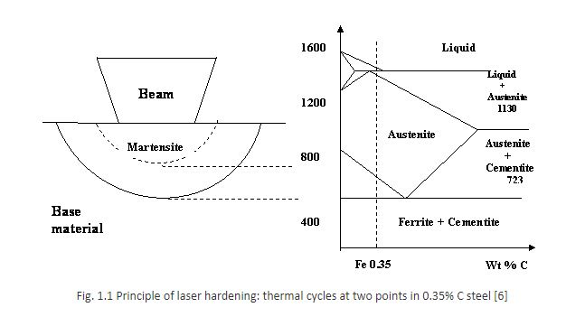
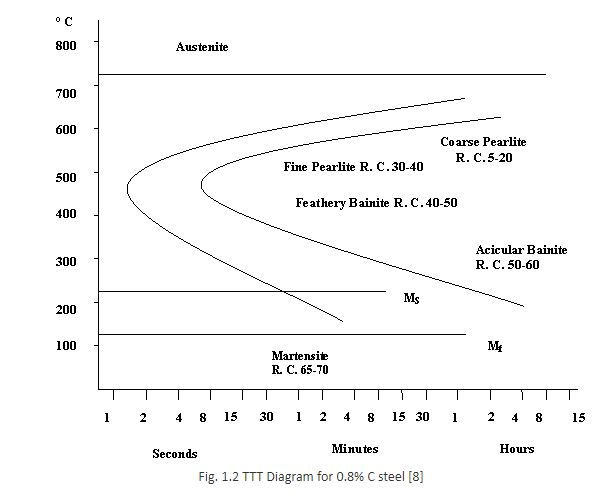

### Theory

### Prerequisite

For better understanding of the experiment a candidate should acquire following knowledge

1.   Formation of laser and related phenomenon
2.   Basic knowledge of Laser Machining process and related terminology
3.   Understanding of various relevant terms viz. transformation hardening/ case hardening

The use of electron beams and laser beams in surface treatment have opened up new industrial possibilities that can lead to finished product quality improvement. These beams, which can concentrate energy on very small area, produce power densities three to four times the order of magnitude higher than conventional processes. This results in special interactions between the beam and the workpiece leading to thermal cycles and consequently to metallurgical characteristics those are difficult to produce with conventional processes.

High energy density infrared light beams complement advantageously the conventional process of treatment. A large number of applications to complex geometrical forms, which are difficult to treat by conventional means can be handled successfully with beam techniques [2]. The use of high power density heating sources for the localized surface treatment of components offers the potential for energy efficiency, low distortion and higher rates of self-quenching which yield useful metallurgical microstructures [3].

Laser transformation surface hardening or laser hardening is an autogenous method of producing wear-resistant patterns on discrete surface regions of the components. A shaped laser beam is scanned across the surface of component to heat without any melt. A temperature rise of about 1200&deg; C is ideal. The underlying bulk material acts as efficient heat sink for the damped energy, and causing rapid cooling. The hardness, strength, wear, fatigue and lubrication properties of the surface can be improved, while desirable bulk properties such as toughness and ductility remain unaffected [4]. Laser surface hardening is an industrial treatment used to provide hardened surfaces in iron and steel through a solid-state transformation [5]. Ferrous alloys are particularly suitable for laser hardening because fast quenching produces hard martensite. Depending on the material, hardness value up to about 1000 Hv can be achieved to a depth of around 1.5 mm, before surface melting occurs [6]. The process may be used for other materials in which a hardening phase change is induced by a thermal cycle [4].

Until the mid-1990s, only CO2 lasers were able to deliver the power density required for economic rates of hardening large areas. Then Multikilowatt Nd:YAG and (a few years later) diode laser sources became available, which produce beams that are absorbed more readily by the metal surfaces, resulting in improvements in process efficiency and which led to an increase in the scope of application for its pulsed form. The principal objective of laser hardening is to produce a surface with a required hardness to a prescribed depth with the highest coverage rate possible [3].

**1.1 Principles of laser transformation hardening**
The principles of laser hardening are similar to those of conventional hardening. The time scales involved in the former are, however, typically an order of magnitude shorter. Conventionally heating is induced by a furnace, flame, arc or induction coil, whereas the laser beam is shaped into a suitable pattern and scanned over the component.
Induction hardening is growing because it is a fast and clean method well suited for on-line applications in the workshop. Laser hardening has many features common with induction hardening. M Melander et al [10] developed computer programs for induction hardening and laser hardening and some results obtained with them. The experimental results in some cases are comparable.

 

The surface is heated rapidly to a temperature between a critical solid-state transformation temperature and the melting temperature. This is illustrated for carbon steel in fig 1.1. The large volume of adjacent material acts as an efficient heat sink, which cools the surface rapidly. Surface hardening is achieved through phase transformations, notably the formation of martensite in ferrous alloys. The structural properties of the bulk material, such as toughness and fracture resistance are retained, thus producing an ideal composite structure [6].

**1.1.1 Beam- material interaction**

During solid-state transformations laser heating, the fraction of the beam power absorbed depends on the absorptivity of the material surface [8]. In uncoated ferrous alloys, the photons of the laser beam interact with free electrons in the substrate in a layer approximately 100 &mu;m thick. Energy is transferred into bulk of the substrate by classical thermal conduction. Absorption of the laser beam may be increased by the application of an absorbing layer [6].

In many cases, the absorptivity is relatively low, especially for CO2 laser radiation. Special absorption coatings such as graphite and molybdenum disulfide through a thin layer of paint have been shown effective since most organic materials have high absorptivity for CO2 laser light [8]. In many industrial applications of lasers, material processing relies on the heating effect due to absorption of high-power beams incident on opaque mediums. The process of laser-material interaction is fairly well studied and can be adequately described in a wide range of power densities up to 109W/cm2 in terms of the heat model, by which one can conditionally divide the process of laser interaction into a few characteristic stages:

1. absorption of laser beam and conservation of its energy to thermal lattice vibrations;
2. heating without material damage;
3. onset of vaporization in the interaction region and scatter of disintegration products; 
4. cooling (quenching) after the laser interaction ceases.

Along with these stages, diffusion and chemical processes take place and phase transformations occur, which have a considerable effect on the character of laser-material interactions. The amount of absorbed energy depends on the optical and thermal properties of materials, especially on the properties of metals; it decreases with increasing wavelength [1].

**1.1.2 Microstructural homogenization**

In ferrous alloy materials, the formation of homogenous austenite facilitates hardening by distributing carbon uniformly to transform martensite on cooling. The extent of austenite homonogenization is dependent on the kinetic effect of thermal cycle experienced at a given point in the heated region. The kinetic effect is essentially a measure of the amount of diffusion that occurs during the thermal cycle. Homogenization of austenite may be controlled by diffusion of carbon; from dissolved pearlite colonies in hypoeutectoid steels or diffusion of metallic elements, from dissolving carbides in highly alloyed steels.

**1.1.3 Phase transformation in cooling**

In ferrous alloys, austenite transforms into ferrite, pearlite, bainite or martensite depending on the severity of cooling portion of the thermal cycle. The phase transformations on cooling can be predicted by using appropriate continuous cooling transformation (CCT) diagram. When considering the use of CCT diagrams, it is important to note that they are constructed for a particular prior austenite grain size and since austenite grain growth is limited during laser hardening, a diagram relevant for a small grain size should be used [6].

Under slow cooling conditions, this high-temperature austenite phase reverts to ferrite and carbide structure. The rate of cooling affects this reaction. A more finely divided distribution of carbides in ferrite with increased tensile strength is produced as the cooling rate increases. If the cooling rate exceeds a critical value, the reaction to carbide and ferrite is suppressed and austenite is retained down to much lower temperatures. Processes that produce these rapid cooling rates are often called "quenching". If austenite is retained below a critical temperature Ms, a structure called martensite is formed. The reaction to form martensite is not time dependent, and depend only the temperature which austenite reaches. The cooler the temperature the greater the percentage of martensite formed. Because martensite is harder than the other crystalline structures, the result of rapid heating and quenching process is a surface layer with a high value of hardness.

Time-Temperature-Transformation (TTT) diagram shown in figure 1.2 is used to indicate the reaction rates and the transformation products produced for 0.8% carbon steel. The two "C" shaped curves represent the time of the beginning and the completion of the reaction of austenite to ferrite and carbide. The values of Rockwell hardness are indicated for the various structures as RC. It is apparent that the martensite has a substantially higher value of hardness than the other crystalline forms [8]. The transformation of austenite to martensite is accompanied by a 4% increase in volume, which induces compressive residual stresses in the transformed region, imparting high fatigue resistance. However, high concentrations of carbon and other austenite stabilizing elements such as nickel and manganese reduce the start and finish temperatures for martensite formation, which may result in the presence of retained austenite in the room temperature [6].